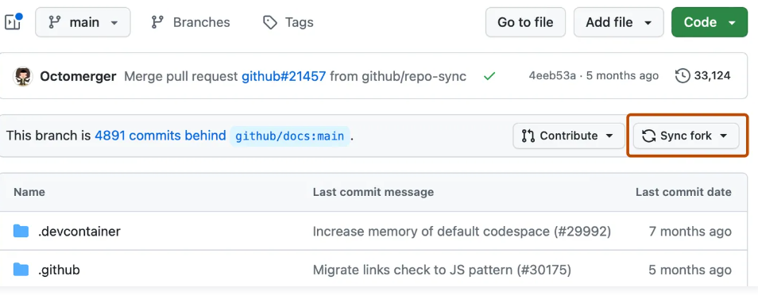

### Before you start: setting up the fork
To start working on the assignments, you need to create and configure a fork of this repository. You only have to do it once. Here is how you do it:

First, fork this repository using the Fork button on the top right corner.

Due to some GitHub limitations, all other students will be able to see your fork, and therefore the answers you submit. To fix that, go to the settings of your fork

then to the "Manage access" section (here you may need to enter your password again)

and finally delete everyone except `$teacher_login` (so I have access to your submissions)

.

### Editing and compiling
First. You submit the assignments as LaTeX **source code** (don't add pdfs, logs, etc.). Of course, the code must be valid.

The code will be checked with the `pdflatex` utility. You can run it as `pdflatex your_tex_file.tex`. Before submitting,
make sure that your code compiles without errors and that the resulting pdf looks nice.

You are free to use any text editor/IDE for the TeX files. Just make sure the resulting files have reasonable encoding (
ascii or utf-8) and UNIX newlines. 

Please keep the code nice and readable: 
 - use LaTeX commands instead of unicode characters: ɾ and r may be easy to confuse (depending on the font), while
 `\R` and `r` are obviously different.
 - keep lines shorter than ~150 chars, nobody likes horizontal scrolling
 - TODO

Second. You submit the code in Python when the assignment requires it. You commit your code files together with your LaTeX files. Some of the assignments will test your code on several test cases with verification utility (don't forget to turn on the Actions in the Action tab on your Github).

### Submitting the assignments
Use git as usual: clone your fork, edit the relevant assignment file in `assignments/<labbook number>`, commit and push the files. 

When ready, submit a link to the last commit via the Brightspace environment.

To find this link, go to the main page of your fork, click on the last commit hash

click on "Browse files"

and copy the resulting URL. 

The url should look similar to `https://github.com/YourUsernameHere/labbooks_tts2024/tree/074d58ca6b9e3ee9897755ba0f9bdbeb25ce6844`.

### Updating the assignments list 
When new assignments are added, you need to propagate them to your fork manually.

To do so, go to your fork's page and press the button "sync fork". 

### Compiling the assignments
The repository has a script called `build.sh` on the top level. Make sure it succeeds before submitting your assignment. 

To help you run the script in a "clean" environment, a Github Action is added to the repository.
After you commit&push something, an automatic check will start. You can see the status of the check
near the last commit information. The check will take a few minutes, then the circle will become either a green checkmark if all is good, or a red cross if something is broken (there are several workflows, so some of them can succeed and some of them might not).

You can also see all the recent runs by clicking on the "Actions" button under the repository name.

If the check fails, first look at the "Annotations section" of the run summary. 

If the LaTeX check succeeds, your TeX code is officially considered valid (only the syntax, not the answers to the actual assignment you wrote there!). Submitting TeX that doesn't compile results in lower grade. 
If the Python check for the specific assigment succeeda for one or more test cases, your Python code is officially considered valid. 

### Minimalistic git forking flow ("how to" description)

Here is a [link to a short git101 tutorial that matches our needs in Speech Sounds and Speech Synthesis I classes](https://github.com/Equidamoid/git101/).

## DOs and DONTs

### Keep the structure
Every assignment has a dedicated directory: `assignments/<code>`. If you want to add extra files (
figures, code, data, etc.), put them in this directory.

### Don't move stuff around
 Please don't rename the assignment directory (or the assignmentX.tex file inside). This makes it difficult to grade your work.

### Make sure everything compiles and runs
 - For TeX files, check that the build is "green" (see above).
 - If you submit code, make sure it can be run without modifications (use relative paths, etc.).
If you feel extra nervous, you could clone the repository in a separate place and try to run the scripts from this new "clean" workspace.
# labbook_tts2024
